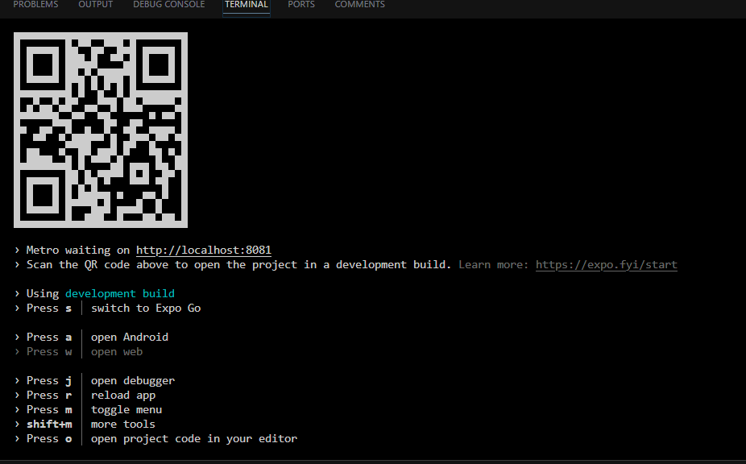
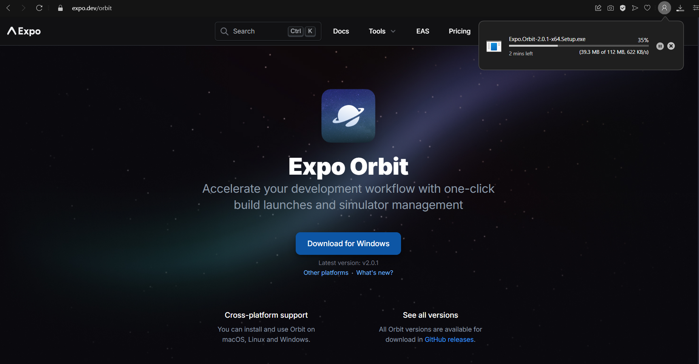
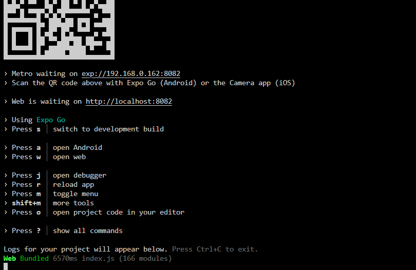
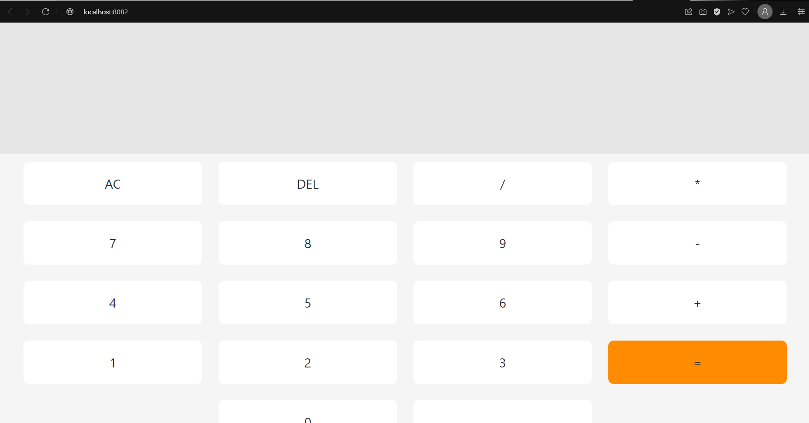
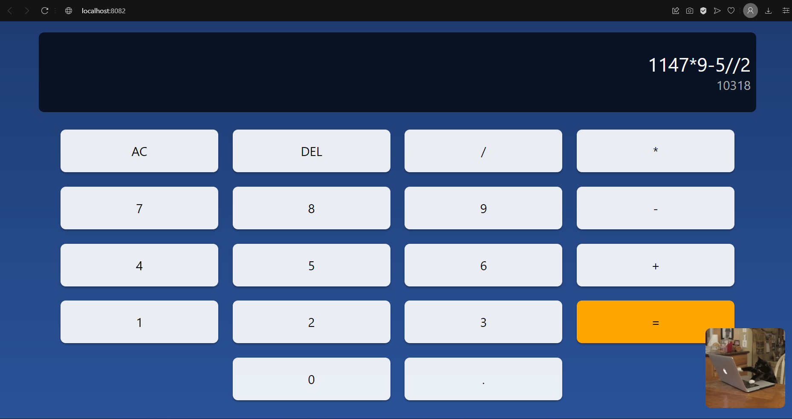

Step-by-step tair's explanation of what i've learned from creating this project:

1) npm install -g expo-cli
2) expo init CalculatorApp
3) Choose a template: » blank
4) cd CalculatorApp
5) npx expo
6) 
7) 
8) npx expo install react-dom react-native-web @expo/metro-runtime
9) 
10)  // запустил в веб  
11) написал App.js
12) проверил. 
13) решил улучшить дизайн, а то калькулятор смотрелся сухо и не интересно.
14) npx expo install expo-linear-gradient
15) гифка с котиком (https://giphy.com/gifs/JIX9t2j0ZTN9S)
16) 
17) теперь калькулятор с небольшим дизайном (синий темносиний и с котиком)
18) <git init>
    git add .
    git commit -m "Initial commit for calculator app"
19) git remote add origin https://github.com/taircaldy/CalculatorApp.git
20) git branch -M main
    git push -u origin main
21) I created code space on github and cloned this project into it.
22) All done! 

