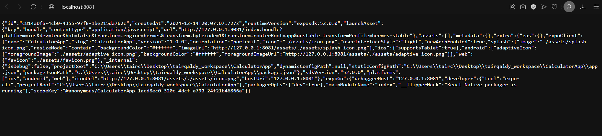

# CalculatorApp

### Step-by-Step Explanation by tairqaldy of What I’ve Learned While Creating This Project:

1. Installed Expo CLI globally:
   ```bash
   npm install -g expo-cli
   ```

2. Created a new Expo project:
   ```bash
   expo init CalculatorApp
   ```
   - Chose the template: **blank**.

3. Navigated into the project folder:
   ```bash
   cd CalculatorApp
   ```

4. Started the project:
   ```bash
   npx expo
   ```
   

5. Installed necessary dependencies for web support:
   ```bash
   npx expo install react-dom react-native-web @expo/metro-runtime
   ```
   

6. Ran the project in the web environment:
   ```bash
   npx expo start
   ```
   

7. Wrote the `App.js` file with basic calculator functionality and clean UI design.

8. Tested the app to ensure it worked correctly:
   

9. Decided to improve the design to make the calculator visually appealing.

10. Installed `expo-linear-gradient` for a gradient background:
    ```bash
    npx expo install expo-linear-gradient
    ```

11. Added a **fun cat GIF** as part of the design:
    

12. Finalized the improved design with a gradient background and the cat GIF:
    

13. Now, the calculator features a beautiful blue gradient background and an adorable animated cat! 😺
    

14. Tested it with IOS emulator, **Expo Go** & **Expo Orbit**

---

### P.S. Git Commands for Uploading the Project to GitHub:

1. **Check current remotes**:
   ```bash
   git remote -v
   ```

2. **Remove incorrect remote** (if needed):
   ```bash
   git remote remove origin
   ```

3. **Add the correct GitHub remote**:
   ```bash
   git remote add origin https://github.com/tairqaldy/CalculatorApp.git
   ```

4. **Push the project to GitHub**:
   ```bash
   git push -u origin main
   ```

5. If prompted for authentication, use a personal access token.

6. After initial setup, you can push updates with:
   ```bash
   git push -u origin main
   ```
   Have fun! 🎉
